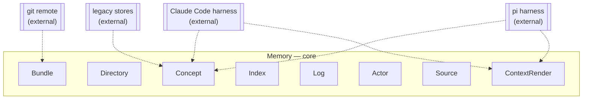
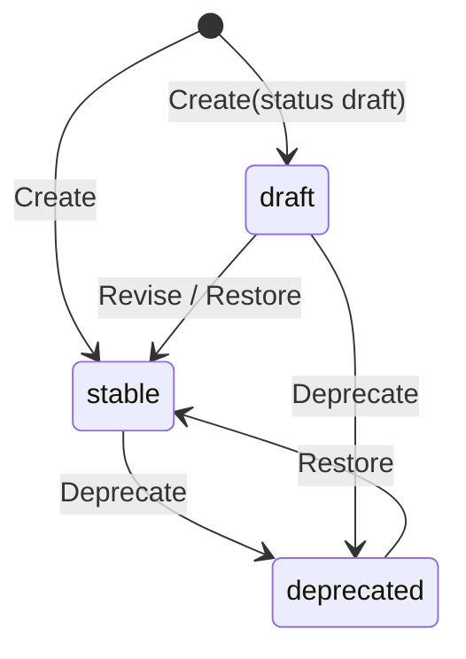
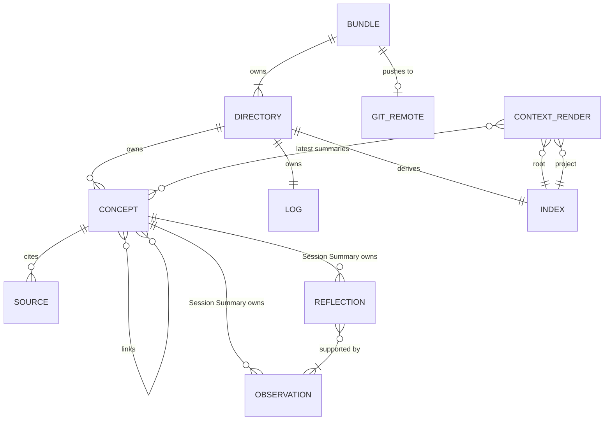
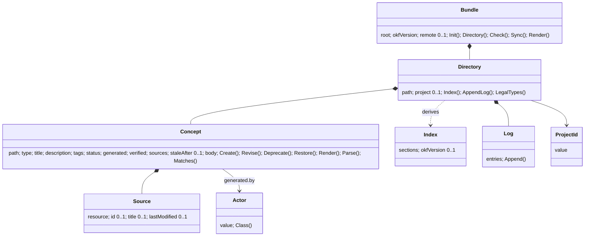

# memory domain model

## Contexts

Harnesses reach the context render (read) and the concept constructor (write) through the CLI. Legacy stores reach the concept constructor through importers. Nothing else crosses.

## Bundle

Entity, one per user. The OKF bundle at `MEMORY_DIR`, a git repository.

### Fields

| Field | Type | Meaning |
|---|---|---|
| `root` | absolute path | identity; the directory holding root `index.md` |
| `okfVersion` | string | `"0.2"`, written in root `index.md` frontmatter, the only place OKF permits it |
| `remote` | `GitRemote` | 0..1; absent means local only, and `doctor` reports it |

### Behaviors

`Init(remote?)`, `Directory(projectId?)` (root when absent), `Concept(path)`, `Concepts(filter)`, `Check()`, `Sync(mode)`, `Render(projectId, summaries, budget)`.

### Invariants

- `root` is a git work tree with root `index.md` present; `Init` establishes both or fails.
- `Sync` never runs two git operations at once: a lock directory under `root` with a stale timeout serializes them, and a caller that finds it held returns without waiting.

### Relationships

| With | Kind | Cardinality |
|---|---|---|
| `Directory` | has-a (owned) | 1 to n, n ≥ 1 (the root) |
| `GitRemote` | references | 1 to 0..1 |

## Directory

Entity, owned by `Bundle`. The bundle root or one `projects/<project id>/`. Owns its index and log.

### Fields

| Field | Type | Meaning |
|---|---|---|
| `path` | bundle-relative path | identity; `""` for the root, `projects/<id>` otherwise |
| `project` | `ProjectId` | 0..1; absent means this is the root |

### Behaviors

`Index()` (regenerate from concepts), `AppendLog(entry)`, `LegalTypes()` (root: all but `Project`; project: all but `User`).

### Invariants

- A concept's type is legal for its directory; the constructor refuses otherwise.
- `index.md` equals `Index()`; `check` fails when it does not.

### Relationships

| With | Kind | Cardinality |
|---|---|---|
| `Concept` | has-a (owned) | 1 to n, n ≥ 0 |
| `Index` | derived-from concepts | 1 to 1 |
| `Log` | has-a (owned) | 1 to 1 |
| `Bundle` | owned by | n to 1 |

## Concept

Entity, aggregate root. One OKF concept document. One concept per git commit is the transaction.

### Fields

| Field | Type | Meaning |
|---|---|---|
| `path` | bundle-relative path | identity; `<directory>/<type dir>/<slug>.md`, slug derived from `title`; a Session Summary's slug is its `generated.at` stamp plus actor, so two harnesses summarizing at once never collide |
| `type` | `ConceptType` | OKF `type` |
| `title` | string | non-empty; the slug source |
| `description` | string | one sentence for index entries and recall snippets |
| `tags` | list of string | may be empty |
| `status` | `Status` | OKF `status`; written explicitly, never left to the spec default |
| `generated` | `{ by: Actor, at: instant }` | who last changed the content and when |
| `verified` | list of `{ by: Actor, at: instant }` | may be empty; OKF says empty means unverified |
| `sources` | list of `Source` | may be empty only for `human:` actors typing directly; adapters and importers always give one |
| `staleAfter` | instant | 0..1; absent means never stale, per OKF |
| `body` | markdown | free form; bundle-relative links |

Unknown frontmatter keys are preserved on round trip, as OKF requires.

### Behaviors

`Create(fields, actor)`, `Revise(fields, actor)` (same slug, bumps `generated`), `Deprecate(actor)`, `Restore(actor)`, `Render()` (frontmatter plus body), `Parse(text)`, `Matches(query)` (recall ranking input).

### Invariants

- `type` is in the vocabulary and legal for the directory.
- `title` is non-empty after trimming; the slug it yields is non-empty.
- `generated.by` is a well-formed `Actor`.
- `sources[].resource` values are unique within the concept.
- No secret pattern in `title`, `description` or `body`; refusal writes nothing.
- Every mutation rewrites the whole file temp-then-rename, so a reader never sees a partial concept. Concept writes take no lock; the same slug written twice is last-writer-wins.

### States

Anything not drawn is refused. `deprecated` concepts leave the index and the context render, remain on disk and in recall with `--deprecated`.

### Relationships

| With | Kind | Cardinality |
|---|---|---|
| `Directory` | owned by | n to 1 |
| `Source` | has-a (owned) | 1 to n, n ≥ 0 |
| `Actor` | has-a (value) | 1 to 1 in `generated`, 1 to n in `verified` |
| `Concept` | references (markdown link) | n to n; a broken link is tolerated, per OKF |
| `Observation` | has-a (owned), `Session Summary` only | 1 to n, n ≥ 0 |
| `Reflection` | has-a (owned), `Session Summary` only | 1 to n, n ≥ 0 |

## Index

Value object, derived from a directory's concepts, written to `index.md` for OKF consumers. Never authoritative.

### Fields

| Field | Type | Meaning |
|---|---|---|
| `sections` | ordered list of `{ type: ConceptType, entries }` | one section per type present, vocabulary order |
| `entries` | list of `{ title, link, description }` | non-deprecated concepts, title order; Session Summaries newest first |
| `okfVersion` | string | root index only |

### Invariants

- Rendered form is OKF §8: `# <Type>` heading, `* [Title](relative link) - description`.
- Deterministic: the same concepts render the same bytes.

## Log

Entity, owned by `Directory`. The OKF §9 change history in `log.md`, append only.

### Fields

| Field | Type | Meaning |
|---|---|---|
| `entries` | list of `{ date, kind: LogKind, text }` | newest date first, one `## YYYY-MM-DD` heading per day |

### Behaviors

`Append(kind, concept, actor)`.

### Invariants

- Dates are ISO `YYYY-MM-DD`; an entry lands under today's heading, created when absent.

## ContextRender

Value object, derived, never stored. What a harness injects at session start.

### Fields

| Field | Type | Meaning |
|---|---|---|
| `rootIndex` | `Index` | |
| `projectIndex` | `Index` | for the resolved project; an empty index when the project directory does not exist yet |
| `summaries` | list of `Concept` | latest N Session Summaries for the project, N given by the caller; the current session's own summary first when a session resource is given |
| `budget` | bytes | 0..1; absent means no cap; when present, summaries are dropped oldest first, then truncated |

### Invariants

- Deterministic for the same bundle state and arguments, so a harness prefix cache holds.
- Contains no instructions; adapters add their own usage note outside the block.

## Observation

Value object, owned by a `Session Summary` concept, one line under `# Observations`. Append-only.

### Fields

| Field | Type | Meaning |
|---|---|---|
| `id` | 12 hex chars | identity within the concept; the recall key |
| `at` | instant | when the observed thing happened, minute precision |
| `relevance` | `Relevance` | prune order |
| `content` | one line | what happened or was established |
| `sourceEntryIds` | list of string | transcript entry ids it came from; n ≥ 1 |

### Invariants

- Never rewritten after append; pruning removes whole lines.
- `sourceEntryIds` resolve against the transcript named in the concept's `sources[]`.

## Reflection

Value object, owned by a `Session Summary` concept, one line under `# Reflections`.

### Fields

| Field | Type | Meaning |
|---|---|---|
| `id` | 12 hex chars | identity within the concept; the recall key |
| `content` | one line | a durable fact about the user, project, decision or constraint |
| `supportingObservationIds` | list of string | observations whose durable meaning it preserves; n ≥ 1; the pruner treats these as covered |

### Invariants

- Rewritten only by a reflector pass; a pass replaces the whole section.

## Relevance

Enumeration: `low`, `medium`, `high`, `critical`. Prune order ascending.

## FoldCheckpoint

Value object, per session, stored under `<bundle>/.state/<session slug>.json`, gitignored, machine local.

### Fields

| Field | Type | Meaning |
|---|---|---|
| `session` | string | the session resource, same value as the summary's `sources[].resource` |
| `transcriptBytes` | integer | bytes of the transcript already folded |
| `foldedAt` | instant | when the last fold finished |

### Behaviors

`Due(transcriptSize, threshold)`, `Advance(bytes)`.

### Invariants

- `transcriptBytes` never decreases; a transcript shorter than the checkpoint (a new file for the same session) resets it to zero.

## ProjectId

Value object. Identifies a project across machines.

### Fields

| Field | Type | Meaning |
|---|---|---|
| `value` | string | `host/owner/repo` from the git origin, or `local/<repo basename>` |

### Invariants

- From an origin URL: scheme, credentials and `.git` stripped, host lowercased, `git@host:owner/repo` accepted.
- Segments contain no `..`, no leading `/`, no whitespace.
- A working directory outside any git repo yields `local/<basename of cwd>`.

## Actor

Value object, OKF §7.

### Fields

| Field | Type | Meaning |
|---|---|---|
| `value` | string | `<producer>/<version>`, `human:<id>` or `process:<id>` |

### Behaviors

`Class()` yields `agent`, `human` or `process`; consumers derive trust tiers from it.

### Invariants

- Exactly one of the three shapes; anything else is refused.

## Source

Value object, OKF §5.1.

### Fields

| Field | Type | Meaning |
|---|---|---|
| `resource` | string | required; URL, bundle path, `file://` path, or a session descriptor such as `pi:session/<uuid>` |
| `id` | string | 0..1; present only when the body footnotes it |
| `title` | string | 0..1; human label |
| `lastModified` | instant | 0..1; the legacy file's mtime for imports, so a rerun can tell changed from unchanged; absent means the source cannot change |

## ConceptType

Enumeration. OKF `type` values this bundle produces.

| Value | Means | Legal directory |
|---|---|---|
| `User` | who the user is: role, expertise, preferences | root |
| `Feedback` | corrections given and approaches confirmed | root, project |
| `Project` | ongoing work, decisions and constraints not derivable from the code | project |
| `Reference` | pointers to external resources | root, project |
| `Session Summary` | one session: append-only observations plus distilled reflections, folded in the background while it lives; or one migrated day | root, project |

## Status

Enumeration, OKF §5.4: `draft`, `stable`, `deprecated`.

## LogKind

Enumeration, the OKF §9 conventional words: `Creation`, `Update`, `Deprecation`, `Initialization`.

## Everything at once

## Open, not assumed

- Whether `Session Summary` needs `stale_after` so consumers can drop old ones without a retention job; currently absent, retention is manual.
- Hermes root entries imported as `Feedback` that are really `Project`: which, and whether a model pass or a hand pass retags them.
- The recall ranking function beyond term overlap; undecided until recall quality is measured against the migrated corpus.
